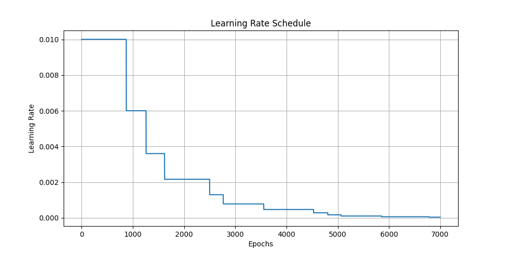
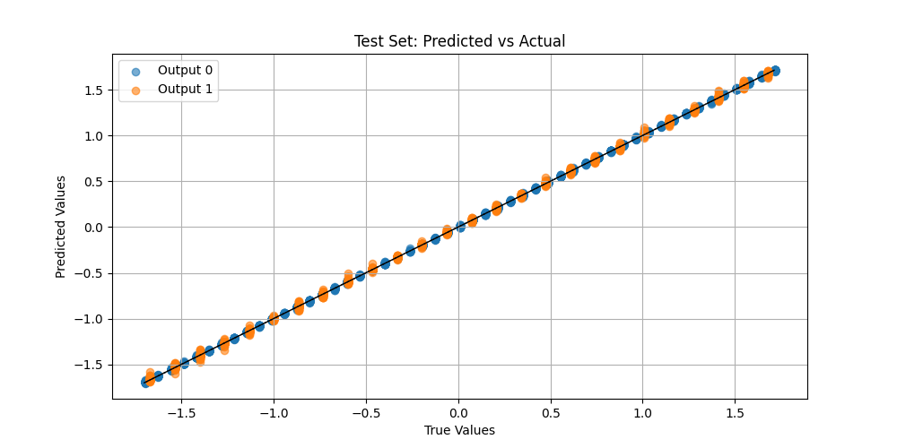

# FFNN from Scratch

This project implements a Feed Forward Neural Network **using only NumPy**. It is designed for educational purposes to help understand the internal mechanics of neural networks rather than relying solely on high-level frameworks.

---

## 🚀 Features

* No external libraries used, everything is in numpy
* Adam optimizer
* Mini-batch Gradient Descent
* Forward propagation
* Backpropagation
* Patience-based learning-rate decay

---

## 📂 Project Structure

```
/Data/Raw
    • Contains the raw maintenance dataset used for training.

/ffnn
    • All core neural-network functions and utilities.

/figures
    • Auto-generated diagnostic plots and evaluation visuals.

main.py
    • Orchestrates training, validation, testing, and plotting.
```

---

## 📦 Installation

```bash
git clone https://github.com/Levonmov0/FFNN-From-Scratch.git
cd FFNN-From-Scratch
pip install -r requirements.txt
```

---

## ▶️ Usage

Run the project with:

```bash
python3 main.py
```

After execution, the model will:

* Train using the provided dataset
* Report training and validation metrics
* Evaluate on a test set
* Generate plots (saved to `figures/`) such as:

  * Training curves
  * Predicted vs Actual scatter plot

---

## 📊 Output & Results

The program produces:

* Final training and validation loss
* Best validation loss during training
* Test loss and per-output MSE
* Regression scatter plot showing predicted vs actual performance

* Examples of plots generated:




These metrics allow you to assess convergence, generalization, and model quality.

---

## 🧠 How It Works

### Model Architecture

The Feed Forward Neural Network consists of:

* Input layer
* Two hidden layers
* Output layer

Each layer performs an affine transformation followed by a nonlinear activation (configurable via a layer-size list).

---

### Training Pipeline

Training uses **mini-batch gradient descent** across several epochs:

1. Shuffle training data
2. Split into batches
3. Forward propagation
4. Loss calculation
5. Backpropagation
6. Parameter update via Adam

Additional features:

* Patience-based LR decay
* Automatic tracking of best model parameters

---

### Optimization

Adam is implemented manually:

* Tracks first and second moment estimates
* Applies bias correction
* Uses per-parameter adaptive learning rates

This results in stable training even with noisy or poorly scaled gradients.

---

### Evaluation

After training, the model:

* Loads the best parameter checkpoint
* Computes test loss and per-output MSE
* Generates predicted vs actual plots

This provides both quantitative and visual insight into model performance.

---

## 🧩 Future Improvements

Potential enhancements:

* Support more activation functions (e.g., ReLU)
* Support additional optimizers (e.g., SGD, Adagrad, RMSProp)

---

## 🔧 Requirements

```
Python 3.9+
numpy>=1.23,<2.0
matplotlib>=3.6,<4.0
```

Install dependencies:

```bash
pip install -r requirements.txt
```

---

## 📜 License

This project is **not licensed** for reuse.
All rights reserved.

You may view the code, but you may **not**:

* Copy
* Modify
* Distribute
* Use it in coursework, assignments, or commercial applications

without explicit permission.

This protects all involved from academic integrity issues.

---

## 🙏 Acknowledgements

Dataset:

Coraddu, A., Oneto, L., Ghio, A., Savio, S., Anguita, D., & Figari, M. (2014).
*Condition Based Maintenance of Naval Propulsion Plants* [Dataset].
UCI Machine Learning Repository.
[https://doi.org/10.24432/C5K31K](https://doi.org/10.24432/C5K31K)

Special thanks to the dataset authors and the UCI repository for enabling open learning and experimentation.
